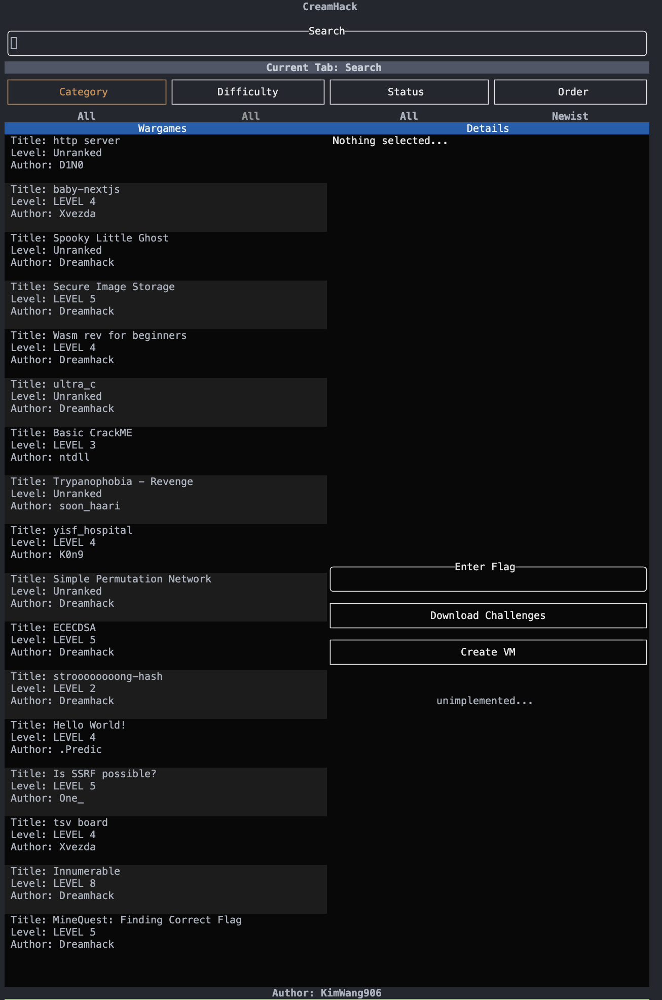

# Creamhack

* Dreamhack TUI Mode



## Feature

1. Search Challenges
2. Search Options
3. Challenges
4. Challenge Info
5. Download Challenge
6. Request Create VM
7. Request Enter Flag

## Usage

* q: Quit
* ctrl + w: Change workdir

### 1. Search

* → / ← : Move Cursor

### 2. Search Options

* → / ← : Select options
* Enter: Open options with popup
  * ↑ / ↓ : Select an option within the popup
  * Enter: Save selected options

## 3. Challenges

* ↑ / ↓ : Select challenge
* g: Go to top

## 4. Challenge Info

* ↑ / ↓ : Select feature
* Enter : Execute selected feature

## Installation

### Ubuntu

```sh
curl --proto '=https' --tlsv1.2 -sSf https://sh.rustup.rs | sh -s -- -y
sudo apt install pkg-config libssl-dev libdbus-1-dev
cargo install --path .
```

### MacOS

```sh
curl --proto '=https' --tlsv1.2 -sSf https://sh.rustup.rs | sh -s -- -y
cargo install --path .
```

### Windows

* TODO
